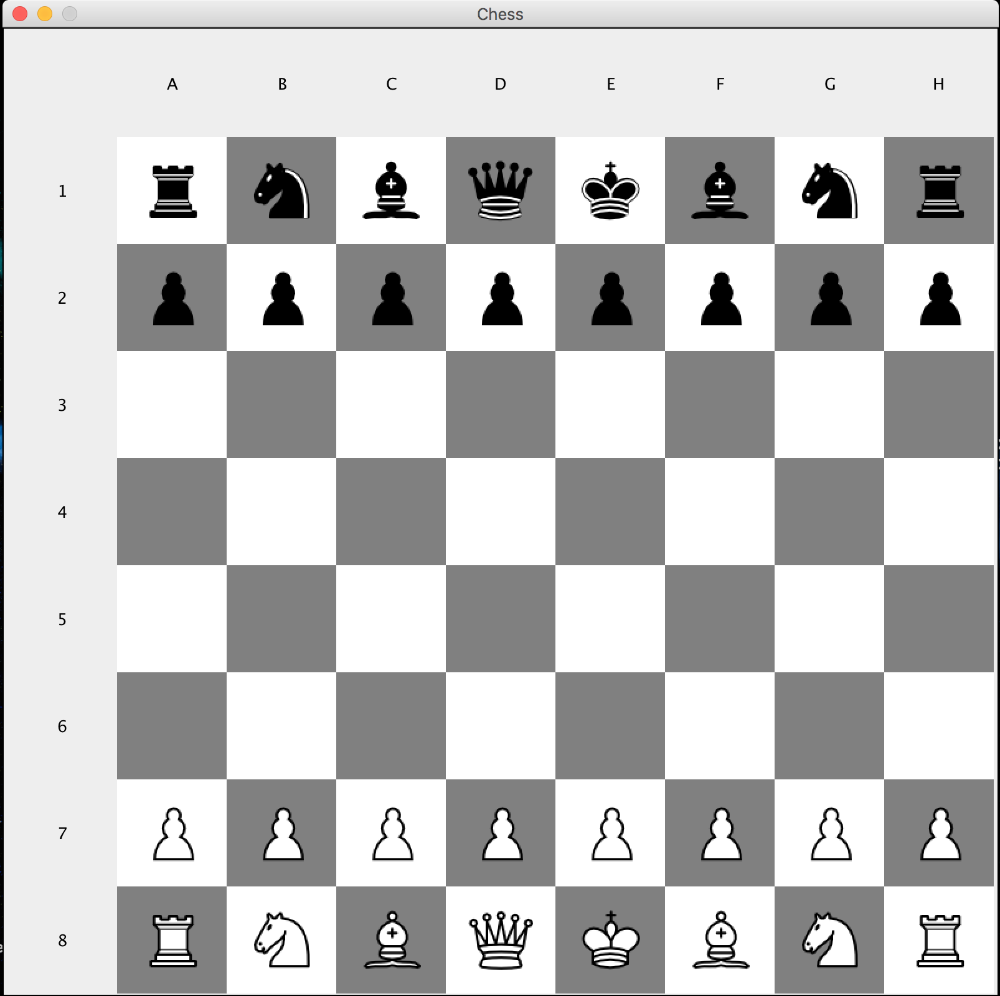

# Chess-AI
Uses the Minimax algorithm with Alpha-Beta Pruning.

The steps involved in building this Chess-engine + Game are - 
1. Building the chesboard and the pieces.
2. Generating the moves for the pieces. (Following the rules of chess)
3. Creating an evaluation function to identify advantage/disadvantage.
4. Implementation of Minimax algorithm with Alpha-Beta Pruning.
5. Customization and additional UI elements.

